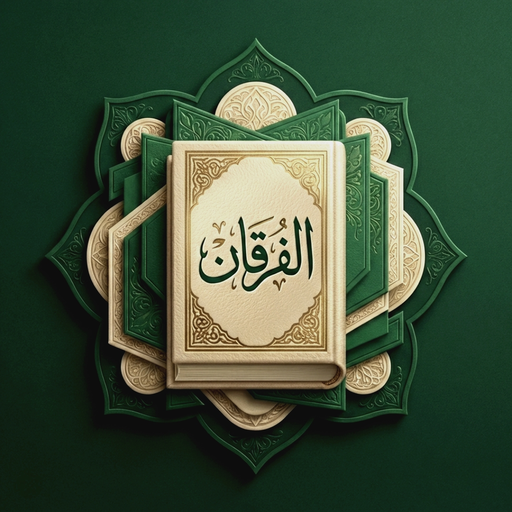

# 📖 Al-Furkan — الفُرقان

   
  <b>تطبيق قرآني متكامل صُمم بأحدث التقنيات مع واجهة استخدام حديثة</b>

[-red?style=for-the-badge)](LICENSE)

---

### 📸 نظرة على واجهة المستخدم (The Interface)

  
  
  
  

  
  
  
  

---

## ✨ التجربة القرآنية الخالصة

لقد قمنا بتطوير "الفُرقان" ليكون الرفيق الرقمي الأمثل لكل مسلم، مع التركيز التام على تجربة المستخدم، الأداء الخالي من التقطيع، والتصميم العصري الحديث.

### 📕 تجربة القراءة والتلاوة
*   **المصحف التفاعلي**: عرض صفحات بصرية تتطابق مع المصحف الورقي بدقة خطوط عثمانية متناهية.
*   **وضع التلاوة (آية بآية)**: تجربة قراءة ليلية מريحة (Dark Mode) مع خيارات تفاعل ذكية لكل آية.
*   **البنية التحتية للصوتيات**: مشغل صوتي متطور مدمج مستوحى من كبرى تطبيقات الصوتيات العالمية، يحتوي على +43 قارئ مشهور مع تتبع الآيات المسموعة كلمة بكلمة.
*   **محرك البحث السريع**: محرك داخلي يوفر لك قدرة على البحث في كامل النص القرآني في أجزاء من الثانية.

### 🧠 التفسير، الترجمة والإعراب
*   يحتوي على أشهر وأوثق التفاسير (كالميسر وابن كثير) مدمجة في شاشة عرض الآيات.
*   إمكانية استعراض الإعراب التفصيلي لكل كلمة.
*   دعم الترجمات لعدة لغات عالمية لخدمة غير الناطقين بالعربية. "قريبًا في تحديثات قادمه باذن الله"

### 🕌 أركان المسلم الأساسية
*   **مواقيت الصلاة الذكية**: خوارزميات حساب دقيقة لمقدار وموعد كل صلاة أينما كنت.
*   **البوصلة والقبلة**: بوصلة دقيقة الاستجابة مع واجهة رسومية تفاعلية.
*   **نظام الختمة**: مخططات الختمة (7، 15، 30 يوم) لمساعدتك على إتمام خطتك القرآنية.

---

## 🏗️ الأركان الهندسية والتقنية (Architecture)

تم بناء التطبيق باستخدام أحدث التقنيات ولغات البرمجة المتاحة في السوق (2025/2026 Standards):

| التقنية (Technology) | الوظيفة (Role) |
|----------------------|----------------|
| **Flutter 3.x** | إطار العمل الرئيسي والتطوير متعدد المنصات (Cross-Platform). |
| **Dart** | لغة البرمجة التي تدير واجهة المستخدم ونواقل البيانات. |
| **flutter_bloc / Cubit** | هندسة معمارية صارمة لإدارة الحالة (State Management). |
| **just_audio** | نواة تشغيل وبث الصوتيات وتتبع التلاوات. |
| **hive_ce** | قواعد البيانات المحلية فائقة السرعة بدون انقطاع للإنترنت (NoSQL). |
| **flutter_animate** | المحرك المسؤول عن حيوية الحركة وانتقالات الواجهة السلسة. |

---

## 🧩 مشاكل معروفة (Known Issues) — محتاجة مساهمة من المطورين

المشروع شغال ومستقر في الاستخدام اليومي، لكن فيه شوية نقاط لسه محتاجة ضبط نهائي. لو إنت مطور وبتقرأ الريبو، دي أماكن بداية ممتازة للإصلاح:

### 1) أبعاد/مقياس آيات المصحف على الشاشات الكبيرة (Tablet / Large Screens)
في وضع **المصحف (QCF)** ممكن تلاحظ إن **عرض/ارتفاع السطور** مش ثابت 100% على بعض الشاشات الكبيرة (خصوصًا تابلت) — ساعات بتحس الآيات “محشورة” أو “متمددة”.

- **مكان الكود المسؤول**:
  - `packages/qcf_quran_with_update/lib/src/qcf_page.dart`
  - تحديدًا حسابات `baselineWidth` / `fontScale` / `verseHeight` + `FittedBox(BoxFit.fitWidth)`
- **المطلوب**:
  - توحيد معادلة الـ scaling بحيث تكون النتيجة متوازنة (أعرض مش أطول) على أحجام 7" / 8" / 10" / 12".
  - يفضّل إضافة جدول معايرة (breakpoints) حسب `shortestSide` بدل معاملات ثابتة.

### 2) دقة القبلة (Qibla) — اختلافات حسب الحساسات/الأجهزة
ميزة القبلة بتعتمد على `flutter_compass` + حساب زاوية الكعبة من `lat/lon`. على بعض الأجهزة (خصوصًا بدون gyro/rotation vector أو بوجود مغناطيسية عالية) الدقة بتختلف.

- **مكان الكود المسؤول**:
  - `lib/src/screen/qibla/qibla_direction.dart`
  - `lib/src/screen/qibla/ar_qibla_screen.dart`
  - حساب الاتجاه: `calculateQiblaAngle(...)`
- **المطلوب**:
  - تحسين فلترة/تنعيم الـ heading (Kalman / low-pass أفضل) + التعامل مع `null`/sensor limitations.
  - إضافة خيار manual calibration + تنبيه للمستخدم لو الحساسات غير مدعومة.

### 3) البحث (Search) — تحسينات تجربة لوحة المفاتيح (IME) على بعض أجهزة أندرويد
في بعض الأجهزة، الـ IME بيحصل له jank لو تم عمل rebuilds كتير أثناء الكتابة.

- **مكان الكود المسؤول**:
  - `lib/src/screen/search/search_screen.dart`
- **ملاحظات**:
  - الأفضل تجنب `setState` على الـ TextField أثناء الكتابة (استخدام `ValueNotifier`/debounce).
  - لو ظهر أي رجوع للمشكلة على جهاز معين، يفضّل توثيق موديل الجهاز + إصدار أندرويد.

---

## 🤝 شكر وتقدير (Acknowledgments)

إن هذا الإنجاز التقني لم يكن ليخرج بهذا الكمال لولا فضل الله، ثم البناء على أعمال إخوة ومطورين كرام:

1. **العرض العثماني للقرآن (QCF Quran)**:
   تم الاستعانة بالمكتبة البرمجية الأساسية [qcf_quran](https://github.com/m4hmoud-atef/qcf_quran) للمطور **محمود عاطف** (جزاه الله خيراً كبيراً).
   *   **إعادة الهندسة والتطوير**: لقد قام **المهندس إدريس غامد** بإجراء عملية [إعادة بناء وتخصيص عميقة للمكتبة](https://github.com/idris-ghamid/qcf_quran_with_update) لتتوافق مع المعايير التصميمية لتطبيق الفُرقان، حيث شملت التعديلات:
       *   بناء وتكامل نظام **`QcfThemeData`** ليتمكن المصحف من تعديل ألوانه ديناميكياً والتفاعل مع نظام (Dark/Light Mode) الخاص بالتطبيق باحترافية.
       *   تطوير نظام **Responsive Typography** يوازن حجم الخطوط القرآنية آلياً ليتناسب بشكل لا تشوبه شائبة مع جميع أحجام وزوايا مئات الشاشات العاملة بنظام تشغيل أندرويد.
       *   الإصلاح الجذري لمشاكل القص البصري للتشكيل (Font Clipping) لتظهر الآيات بمنتهى الصفاء والوضوح.

2. **العمود الفقري وقاعدة البيانات**:
   اعتمدنا في القواعد الأساسية للمشروع (مثل قاعدة بيانات القراء، تفريعات التفاسير، الترجمات، ومحرك العمليات الرياضية لحساب مواقيت الصلاة) على مشروع [al_quran_v3](https://github.com/IsmailHosenIsmailJames/al_quran_v3) المفتوح المصدر للمطور **Ismail Hosen** (بارك الله في جهده). 
   لقد تطابقت رؤيتنا على هذا الأساس ليتم بناء وتطوير هوية بصرية بالكامل (UI/UX) تتبع أحدث منهجيات التصميم (Apple-Style Interface)، إضافة إلى استحداث ميزات تفاعلية متطورة لم تكن موجودة.

---

## 👨‍💻 مخرج المشروع والمطور الرئيسي

تبني وتصميم واجهة المستخدم، وتطوير سائر تقنيات التطبيق، والخروج بنسخة المشروع النهائية بواسطة:  
**IDRISIUM Corp | المهندس إدريس غامد**

---

## ⚖️ الترخيص الوقفي (Charity & License)

هذا المشروع يخضع لترخيص **Apache License 2.0** مقترناً بـ **شرط وقفي قطعي الدلالة**:

التطبيق وكامل المصدر البرمجي (Source Code) الخاص به متاحان كـ **"صدقة جارية"** لوجه الله تعالى عن المطور الرئيسي **إدريس غامد** وشركة **IDRISIUM Corp**.

  <b style="color: red;">يُمنع منعاً باتاً وتاماً وتحت طائلة أي ظرف من الظروف بيع هذا الكود، أو طرح أي تطبيق مبني عليه بهدف التربح أو الاستخدام التجاري المغلق أو إضافة مساحات إعلانية ربحية. يجب أن تظل كافة النسخ المستنسخة منه مجانية للمسلمين 100% مع وجوب الالتزام بذكر المصدر والمطور الأصلي.</b>

لمزيد من التفاصيل المعقمة وشروط الاستخدام، يرجى مراجعة ملف حقوق الملكية والترخيص المرفق [LICENSE](LICENSE).

---

يقول عز وجل

"إِنَّا نَحْنُ نَزَّلْنَا الذِّكْرَ وَإِنَّا لَهُ لَحَافِظُونَ"

